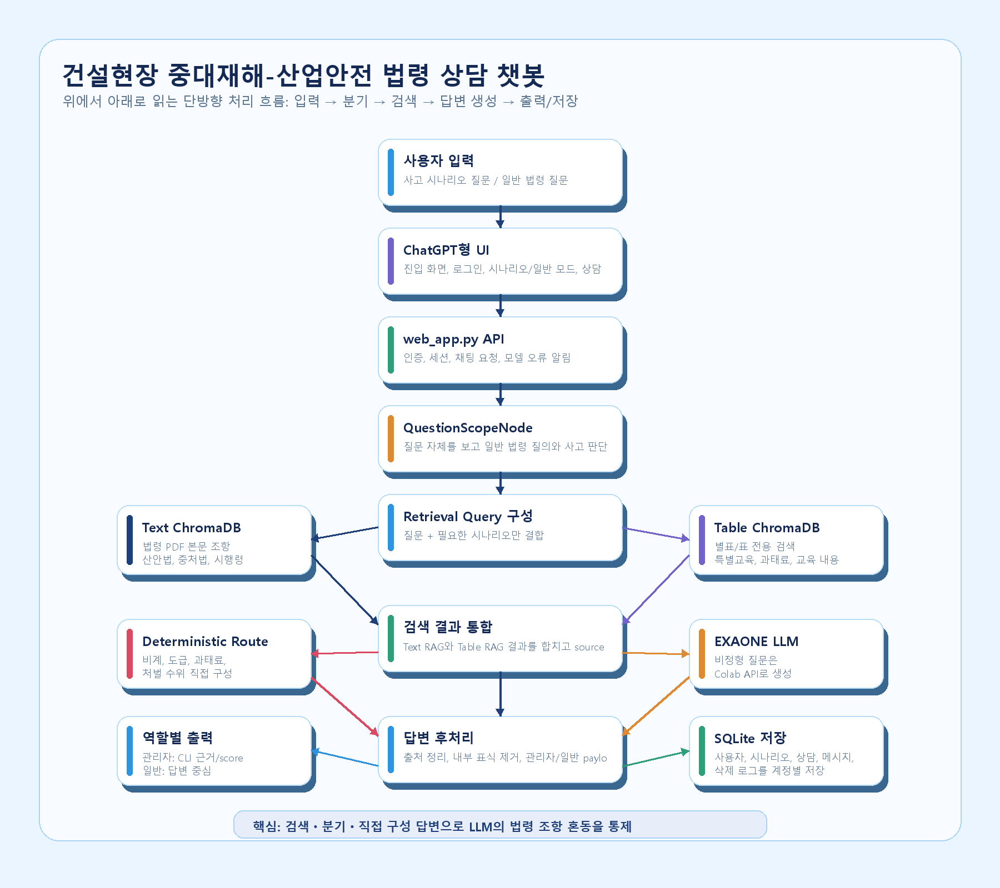
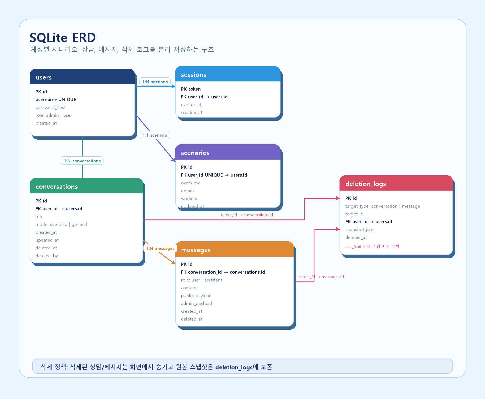
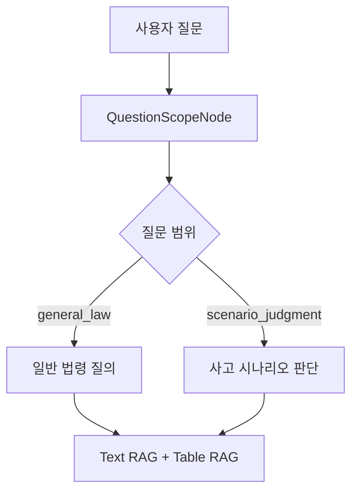
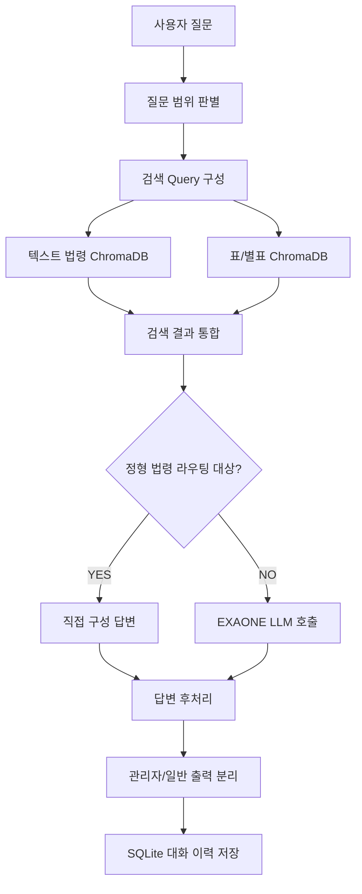

# 건설현장 중대재해-산업안전 법령 상담 챗봇

> 건설현장 사고 시나리오를 기반으로 산업안전보건법과 중대재해처벌법의 위반 조항, 책임 주체, 처벌 수위, 재발방지 조치를 검색ㆍ판단하는 법령 RAG 챗봇입니다.

## 프로젝트 개요

건설현장 사고는 하나의 질문 안에 `사고 사실관계`, `산업안전보건법상 현장 의무`, `중대재해처벌법상 경영책임자 의무`, `별표/표 기준`, `처벌 수위`가 함께 섞입니다. 단순 LLM 답변만으로는 조항 혼동이나 근거 누락이 쉽게 발생하기 때문에, 법령 PDF와 별표 데이터를 직접 임베딩하고 질문 유형별 라우팅을 설계해 답변 안정성을 높였습니다.

이 프로젝트는 CLI 기반 RAG에서 출발해, 사용자 계정과 대화 이력 DB를 가진 ChatGPT형 웹 챗봇으로 확장했습니다.

## Screenshots

### 진입 화면

### 관리자 채팅 화면

### 일반 법령 모드

### 시스템 흐름도

### ERD

## 내가 구현한 핵심 기술

### 1. Text RAG + Table RAG 분리 설계

산업안전 법령은 본문 조항뿐 아니라 별표와 표에 핵심 판단 기준이 많이 들어 있습니다. 예를 들어 특별안전교육 대상 작업, 교육 내용, 과태료 금액은 일반 텍스트 청킹만으로 검색하면 누락되기 쉽습니다.

이를 해결하기 위해 법령 PDF를 두 경로로 분리 처리했습니다.

- 조문 본문: 텍스트 청킹 후 ChromaDB에 임베딩
- 별표/표: `pdfplumber` 기반 표 추출 후 별도 ChromaDB에 임베딩
- 검색 단계에서 텍스트 검색 결과와 표 검색 결과를 통합 정렬
- 답변에는 법령명, 조항, 별표, 페이지 정보를 함께 반환

### 2. 질문 범위 분기 노드 구현

저장된 사고 시나리오가 있어도 사용자의 질문이 항상 사고 판단을 요구하는 것은 아닙니다.

예를 들어 `비계 작업 특별안전교육 미실시가 위반인지 판단해줘`처럼 단순 법령 질문을 했는데, 시스템이 저장된 사고 시나리오까지 끌어와 위반 판단을 고정 출력하는 문제가 있었습니다.

이를 막기 위해 `QuestionScopeNode`를 구현했습니다.

- 질문 자체에 `위 사고`, `시나리오`, `C씨`, 특정 회사명 등 사고 지시어가 있는지 판별
- 사고 지시어가 없으면 일반 법령 질문으로 분리
- 일반 모드에서는 저장된 사고 시나리오를 사용하지 않음
- 향후 LangGraph로 확장할 수 있도록 node/state 형태로 구성

### 3. Deterministic Route로 LLM 조항 혼동 보정

EXAONE 7.8B 모델은 검색 결과가 조금만 흔들려도 유사 조항을 섞어 답변하는 경우가 있었습니다. 특히 `비계`, `도급`, `경영책임자`, `과태료`처럼 반복되는 키워드에서 같은 답변이 재출력되거나 관련 없는 조항을 primary 근거로 쓰는 문제가 있었습니다.

그래서 정형성이 높은 법령 질문은 LLM에만 맡기지 않고 직접 구성 답변으로 우회했습니다.

- 비계 작업 특별안전교육: 산업안전보건법 시행규칙 별표 5 제23호
- 보호구 및 비계 설치 기준: 산업안전보건기준에 관한 규칙 제32조, 제42조, 제56조~제62조, 제14조
- 사업주 책임 및 과태료: 산업안전보건법 시행령 별표 35
- 도급/원청 책임: 산업안전보건법 제64조, 중대재해처벌법 제5조, 시행령 제4조제9호
- 중대재해처벌법 처벌 수위: 제6조, 제7조, 제15조

이 방식으로 RAG 검색 결과를 보강하면서도, 법령 조항과 금액처럼 틀리면 안 되는 항목은 deterministic하게 고정했습니다.

### 4. 관리자/일반 사용자 출력 권한 분리

운영자는 답변 품질을 검증하기 위해 검색 근거, score, 모델명, 응답 시간이 필요하지만, 일반 사용자에게는 이런 정보가 오히려 가독성을 해칩니다.

웹 UI에서 계정 역할을 분리해 다음처럼 출력 정책을 다르게 구현했습니다.

- 관리자: CLI 전체 출력, 참고 근거, score, 모델명, 응답 시간 표시
- 일반 사용자: 최종 답변 중심 표시, score와 내부 진단 정보 숨김
- 모델 연결 실패 시 SweetAlert로 설정 확인 알림
- 입력 시간과 출력 시간을 메시지별로 표시

### 5. 사용자별 대화 이력 DB와 삭제 로그

단순 프론트 상태가 아니라 SQLite DB에 사용자별 데이터를 저장하도록 구현했습니다.

- 사용자 계정
- 로그인 세션
- 사용자별 사고 시나리오
- 시나리오 모드 / 일반 법령 모드별 상담
- 질문/답변 메시지
- 채팅 이름 수정
- 채팅 삭제
- 삭제 시 원본 스냅샷 로그 보존

채팅 삭제는 실제 데이터를 바로 없애지 않고 화면에서 숨김 처리하며, `deletion_logs`에 삭제 시점의 스냅샷을 남기도록 했습니다.

### 6. CLI 프로젝트를 웹 챗봇으로 확장

초기에는 CLI에서 사고 시나리오를 입력하고 질의응답하는 구조였습니다. 이후 실제 사용성을 높이기 위해 ChatGPT형 웹 UI로 확장했습니다.

- 진입 화면 → 로그인 화면 → 챗봇 화면 플로우
- 시나리오 모드 / 일반 법령 모드 탭
- 새 상담 생성
- 상담 이름 수정
- 상담 삭제 메뉴
- 질문/답변 복사
- 생각중 / 정리 완료 상태 메시지
- 파스텔 블루 톤의 반응형 UI

## 기술 스택

| 구분 | 기술 |
|---|---|
| Language | Python, JavaScript |
| Backend | Python `http.server`, SQLite |
| Frontend | HTML, Tailwind CSS CDN, Vanilla JS, SweetAlert2 |
| Vector DB | ChromaDB |
| Embedding | BAAI/bge-m3 |
| RAG | Text RAG, Table RAG, custom retriever merge |
| PDF Processing | pypdf, pdfplumber, PyMuPDF |
| LLM | EXAONE-3.5-7.8B-Instruct, OpenAI-compatible API |
| Runtime | Local RAG + Colab GPU LLM server |

## 시스템 구조

## 문제 해결 사례

### 비계 특별안전교육 조항 혼동 해결

문제:
EXAONE 7.8B가 비계 관련 질문에서 별표 5 제23호 대신 중대재해처벌법 제4조 또는 다른 교육 조항을 근거로 출력하는 문제가 있었습니다.

해결:
비계, 작업발판, 이동식 비계, 비계 조립/해체 키워드가 특별안전교육 질문과 함께 등장하면 별표 5 제23호를 강제 주입하고 직접 답변하도록 라우팅했습니다.

### 단순 질문의 과잉 위반 판단 방지

문제:
시나리오가 저장되어 있는 상태에서 단순 법령 질문을 해도 사고 위반 여부 판단으로 흘러가는 문제가 있었습니다.

해결:
`QuestionScopeNode`를 추가해 질문 자체가 사고 판단을 요구하는지 먼저 구분했습니다. 이로써 일반 법령 질문과 사고 시나리오 판단 질문을 분리했습니다.

### Q2-B/Q2-C 답변 재출력 문제 대응

문제:
중대재해처벌법 책임 질문에서 이전 답변이 반복 출력되는 것처럼 보이는 현상이 있었습니다.

해결:
도급, 원청, 협력업체, 수급인 키워드를 별도 질문 유형으로 분리하고, 도급 관계 책임 템플릿을 추가했습니다. 산업안전보건법 제64조와 중대재해처벌법 제5조를 각각 다른 관점으로 정리하도록 구성했습니다.

## 성과

- 법령 PDF 본문과 표 데이터를 분리해 별표/표 기반 질문의 검색 정확도 개선
- EXAONE 7.8B 모델의 조항 혼동을 deterministic route로 보정
- 일반 법령 질문과 사고 판단 질문을 분리해 과잉 라우팅 방지
- CLI 기반 RAG를 사용자 계정/DB/관리자 모드가 있는 웹 챗봇으로 확장
- 관리자 디버깅 정보와 일반 사용자 답변을 분리해 실제 운영 UI에 가까운 구조 구현

## 한계 및 개선 방향

- 법률 판단 보조 도구이며 최종 법률 자문을 대체하지 않습니다.
- PDF 표 추출 품질에 따라 별표 검색 정확도가 달라질 수 있습니다.
- deterministic route가 많아질수록 유지보수 비용이 증가하므로, 향후 LangGraph 기반 intent routing으로 구조화할 수 있습니다.
- 로컬 RTX 3050 4GB 환경에서는 7.8B 모델 직접 구동이 어려워 Colab GPU 서버 연동을 사용했습니다.

## 담당 역할

개인 프로젝트로 전체 구조 설계와 구현을 담당했습니다.

- 법령 PDF 수집 및 임베딩 파이프라인 구성
- Text RAG / Table RAG 분리 설계
- ChromaDB 기반 검색 및 통합 retriever 구현
- EXAONE LLM 연동 및 프롬프트/후처리 설계
- 질문 범위 분기와 deterministic route 구현
- SQLite 기반 사용자/상담/메시지/삭제 로그 DB 설계
- ChatGPT형 웹 UI 구현
- 관리자/일반 사용자 출력 권한 분리
- 포트폴리오용 스크린샷 및 문서화
