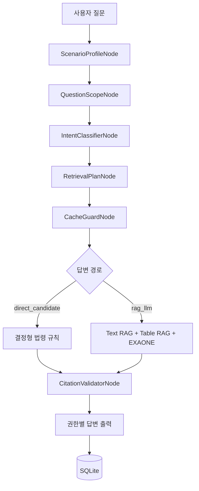

# 건설현장 중대재해-산업안전 법령 상담 챗봇

> 산업재해 시나리오를 분석해 산업안전보건법과 중대재해처벌법의
> 위반 조항, 책임 주체, 처벌 수위와 재발방지 조치를 근거와 함께
> 제시하는 법령 RAG 웹 애플리케이션

## 한눈에 보기

| 항목 | 내용 |
|---|---|
| 프로젝트 형태 | 개인 프로젝트 |
| 담당 범위 | 기획, 데이터 처리, RAG, 백엔드, DB, 프론트엔드, 테스트 |
| Backend | Python 3.11, FastAPI, Uvicorn, Pydantic |
| RAG | ChromaDB, BAAI/bge-m3, Text RAG + Table RAG |
| LLM | EXAONE-4.0-32B, OpenAI-compatible API, Colab Pro |
| Frontend | HTML, Tailwind CSS 3, Vanilla JavaScript, SweetAlert2 |
| Database | SQLite |
| 품질 검증 | pytest, 수동 루브릭, 자동 배포 게이트, Citation Validator |
| 실행 포트 | 8200 |

## 프로젝트 목표

건설현장 사고 질문에는 사고 사실, 현장의 구체적 안전조치, 교육 대상,
도급 구조, 경영책임자 의무와 처벌 수위가 한꺼번에 섞인다.

LLM에게 검색 결과만 제공하면 다음 문제가 반복됐다.

- 비슷한 작업의 특별교육 조항을 서로 혼동
- 사망자와 장기치료 부상자 수를 잘못 읽어 법 적용을 반대로 판단
- 이전 사고의 회사명과 작업 내용이 새로운 질문에 재출력
- 답변에만 존재하고 검색 근거에는 없는 조항을 인용
- 일반 법령 질문을 저장된 사고의 위반 판단으로 과도하게 해석

이 문제를 해결하기 위해 LLM 단독 생성이 아니라 **사고 사실 구조화,
질문 그래프, 결정형 법령 규칙, Text/Table RAG와 출처 검증을 결합한
하이브리드 구조**로 설계했다.

## 화면

### 진입과 로그인

| 진입 화면 | 로그인 화면 |
|---|---|
|  |  |

### 상담 화면

| 관리자 상담 | 일반 법령 모드 |
|---|---|
|  |  |

관리자는 검색 근거, 정규화된 score, 모델명, 응답시간, 질문 그래프와
출처 검증 결과를 확인한다. 일반 사용자는 내부 디버그 정보 없이 최종
답변만 확인한다.

## 정확도 개선 성과

법령 조항, 사실관계, 책임 주체와 답변 구성을 사람이 문항별로 채점한
수동 평가 결과다.

| 사고 유형 | 1차 평가 | 개선 후 | 개선폭 |
|---|---:|---:|---:|
| 용접ㆍ도장 화재·폭발 | 43.6 | 98 | +54.4 |
| 굴착 토사 붕괴 | 33 | 99 | +66.0 |
| 프레스 끼임·협착 | 63 | 94.4 | +31.4 |
| 조적 낙하물 | 38 | 99.6 | +61.6 |
| **평균** | **44.4** | **97.8** | **+53.4** |

별도의 자동 배포 평가에서는 6개 표준 사고 유형의 30개 문항과
10개 배포 게이트를 모두 통과했다.

> 수동 점수는 동일한 결과 보고서가 존재하는 4개 사고 유형의
> 고정 평가셋 결과다. 자동 게이트 통과율이나 전체 법률 정확도와
> 동일한 지표가 아니다.

[평가 기준과 문항별 개선 과정](docs/EVALUATION.md)

## 핵심 아키텍처



현재 질문 그래프는 `rag/question_graph.py`에 구현한 경량 상태 그래프다.
LangGraph와 유사한 node/state 구조를 사용하지만 별도 LangGraph 런타임에
의존하지 않는다.

## 내가 구현한 핵심 기술

### 1. Text RAG와 Table RAG 분리

산업안전 법령의 핵심 정보는 본문뿐 아니라 별표와 표에 많이 존재한다.
특별교육 대상, 교육시간과 과태료를 일반 문단처럼 청킹하면 행 구조와
항목 번호가 무너지기 쉽다.

- 법령 본문을 `chroma_db`에 텍스트 청크로 저장
- 별표ㆍ표를 행 단위로 추출해 `chroma_db_tables`에 별도 저장
- 검색 단계에서 본문과 표 결과를 통합하고 score를 정규화
- 법령명, 조항, 별표와 페이지 정보를 메타데이터로 유지

이를 통해 별표 5 작업 항목과 별표 35 과태료가 다른 조문과 섞이거나
검색에서 누락되는 문제를 줄였다.

### 2. ScenarioProfileNode와 원문 재검증

시나리오를 저장하면 EXAONE은 법률 결론이 아니라 사고 사실만 JSON으로
추출한다. 이후 결정형 검증기가 원문을 다시 읽어 다음 값을 교정한다.

- 회사명과 협력업체명
- 작업 종류와 사고 유형
- 사망자와 부상자 수
- 치료기간 6개월 이상 부상자 수
- 직영ㆍ도급ㆍ파견ㆍ혼재 구조
- 반복 전조, 작업중지와 위험성평가 이행 여부

모든 답변 경로가 동일한 ScenarioProfile을 사용하므로 특정 경로에 남은
과거 회사명이나 비계 사고 문장이 새로운 사고에 출력되는 문제를
구조적으로 차단했다.

### 3. 질문 범위와 의도 분리

저장된 사고가 있어도 모든 질문이 사고의 위반 여부를 묻는 것은 아니다.
`QuestionScopeNode`가 일반 법령 설명과 시나리오 판단을 먼저 나누고,
`IntentClassifierNode`가 다음 질문 유형을 분리한다.

- 특별안전교육
- 보호구ㆍ설치 기준
- 기계 방호ㆍ안전검사
- 사업주 책임과 과태료
- 경영책임자 의무와 처벌
- 도급ㆍ원청 책임
- 종합보고서

이를 통해 `비계`라는 단어 하나만으로 모든 질문이 특별교육 답변으로
고정되거나, 안전검사 질문이 교육 질문으로 분류되는 문제를 해결했다.

### 4. 결정형 법령 라우팅

사망ㆍ부상 요건, 법정형, 작업별 특별교육처럼 정답이 정형화된 영역은
LLM이 조항을 임의로 선택하지 않도록 했다.

예시:

| 질문 유형 | 검증 근거 |
|---|---|
| 비계 조립ㆍ해체 특별교육 | 시행규칙 별표 5 제23호 |
| 굴착면 2m 이상 특별교육 | 시행규칙 별표 5 제19호 |
| 프레스 방호ㆍ정비ㆍ검사 | 기준규칙 제87조~제104조, 법 제80조ㆍ제93조 |
| 낙하물ㆍ발끝막이판ㆍ통제 | 기준규칙 제13조ㆍ제14조ㆍ제20조 |
| 용접ㆍ화기 작업 | 기준규칙 제232조ㆍ제240조ㆍ제241조 |
| 사망 중대산업재해 | 중대재해처벌법 제2조제2호가목ㆍ제6조제1항 |
| 장기치료 부상자 2명 이상 | 제2조제2호나목ㆍ제6조제2항 |
| 도급ㆍ원청 책임 | 산업안전보건법 제63조ㆍ제64조, 중대재해처벌법 제5조 |

키워드 하나가 아니라 작업 동작과 질문 목적을 함께 확인한다. 예를 들어
`철골 구조물 보수 용접`은 골조 조립이 아니라 용접으로 분류하고,
조적 작업은 해당 특별교육 조항이 없으면 억지로 다른 조항을 적용하지
않는다.

### 5. Citation Validator

생성 후 답변의 법령명, 조항과 별표를 검색 근거와 다시 대조한다.

- 답변에만 존재하는 미검증 조항 탐지
- 도급 책임에 필요한 제64조와 제5조 누락 탐지
- 비계 특별교육의 별표 5 제23호 누락 탐지
- 법인 50억원 벌금의 근거를 다른 별표로 잘못 표시한 오류 탐지

결과는 `PASS`, `WARN`, `FAIL`로 저장하고 관리자 화면과 CLI에서
확인할 수 있다.

### 6. 역할 기반 웹 애플리케이션

CLI로 시작한 RAG 시스템을 FastAPI 기반 웹 애플리케이션으로 확장했다.

- 진입 화면, 로그인과 역할별 세션
- 시나리오 모드와 일반 법령 모드
- 계정별 시나리오와 대화 이력 분리
- 새 상담, 이름 변경, soft delete
- 삭제 시 감사 로그에 원본 스냅샷 보존
- 질문ㆍ답변과 관리자 CLI 전체 출력 복사
- 모델 연결 상태와 생성 진행 상태 표시
- 반응형 파스텔 블루 UI와 다크 모드
- 관리자 품질 대시보드와 답변 피드백

보안 측면에서는 CSRF 검증, 로그인 시도 제한, 회원가입 기본 차단,
요청 크기 제한, 허용 호스트와 보안 헤더를 적용했다.

## 대표 문제 해결 사례

### 사례 1. 사망자 환각과 법 적용 반전

프레스 사고는 사망자가 없고 6개월 이상 치료가 필요한 부상자가
1명이었지만, 초기 답변은 사망자 1명으로 판단해 중대재해처벌법을
적용했다.

시나리오 원문에서 사망자와 장기치료 부상자 수를 다시 계산하고 다음
결정형 규칙을 적용했다.

```text
사망자 >= 1                  -> 제2조제2호가목
6개월 이상 치료 부상자 >= 2 -> 제2조제2호나목
장기치료 부상자 == 1         -> 결과 요건 미충족
```

이 개선으로 프레스 끼임 평가의 Q3가 0점에서 100점으로 바뀌었다.

### 사례 2. 과거 비계 시나리오 혼입

새로운 낙하물 사고를 입력했지만 도급 책임과 종합보고서에 과거
`스파일럿건설`, `B사`, `비계 작업`이 출력됐다. 질문 경로마다 서로 다른
직접응답 템플릿이 시나리오를 개별 참조한 것이 원인이었다.

ScenarioProfileNode를 그래프 앞단에 두고 모든 경로가 하나의 검증된
프로파일을 공유하도록 변경했다. 조적 낙하물 평가는 38점에서
99.6점으로 개선됐다.

### 사례 3. 유사 작업 조항 오발화

`철골 구조물 보수 용접`에서 `철골`이 먼저 감지돼 골조 조립ㆍ해체
교육 조항이 출력됐다.

용접ㆍ화기 의도를 우선하고 골조는 `조립`, `해체`, `5m 이상` 같은
동작 단서가 함께 있을 때만 선택하도록 조건을 좁혔다. 동시에 화기작업,
환기와 동시작업 조항을 검색 근거에 추가해 화재·폭발 평가를
43.6점에서 98점으로 개선했다.

## 테스트와 품질 관리

```powershell
python -m pytest -q
python scripts\check_v1_deployment.py
node --check web\static\app.js
python -m compileall -q rag web_app.py tests
```

- 단위ㆍ회귀ㆍ웹 보안 테스트: 38개 통과
- 표준 사고 평가: 6개 유형, 30/30 통과
- 자동 배포 게이트: 10/10 통과
- 신규 도급 holdout 및 일반 법령 회귀 포함
- 답변별 출처 검증과 60초 응답 제한 검사

## 데이터와 권한 구조

SQLite에는 다음 데이터를 계정별로 저장한다.

- `users`, `sessions`
- `scenarios`, `scenario_analyses`
- `conversations`, `messages`
- `deletion_logs`
- `answer_feedback`

대화와 시나리오는 로그인 사용자의 `user_id`로 제한된다. 삭제된 상담과
메시지는 화면에서 제외하지만 감사 로그에 원본 스냅샷을 남긴다.


## 시스템 흐름도


## 한계와 다음 단계

- EXAONE-4.0-32B 추론은 Colab Pro GPU에 의존하므로 런타임 종료와
  ngrok 주소 변경에 대응해야 한다.
- 평가 결과는 고정 테스트셋 기준이며 실제 법률 자문을 대체하지 않는다.
- 감전, 질식과 화학물질 누출은 별도 법령 검토와 holdout 확장이 필요하다.
- 법령 개정 시 원본 갱신, 재청킹과 재임베딩을 수동으로 수행해야 한다.
- 판례와 행정해석 데이터가 부족해 책임 비율이나 불법파견 여부는
  자동으로 확정하지 않는다.

다음 단계는 판례ㆍ행정해석 데이터셋 추가, 법령 개정 감지와 재임베딩
자동화, 미등록 사고 holdout 확대다.

## 담당 역할

개인 프로젝트로 전체 설계와 구현을 담당했다.

- 법령 PDF 수집, 본문ㆍ표 추출과 임베딩 파이프라인
- Text RAG와 Table RAG 통합 검색
- EXAONE API와 프롬프트ㆍ후처리
- 질문 그래프와 결정형 법령 라우팅
- ScenarioProfile 검증과 Citation Validator
- FastAPI 인증ㆍ상담ㆍ관리자 API
- SQLite 사용자ㆍ상담ㆍ감사 로그 DB
- Tailwind 기반 반응형 UI와 다크 모드
- 평가셋, 자동 배포 게이트와 문서화
