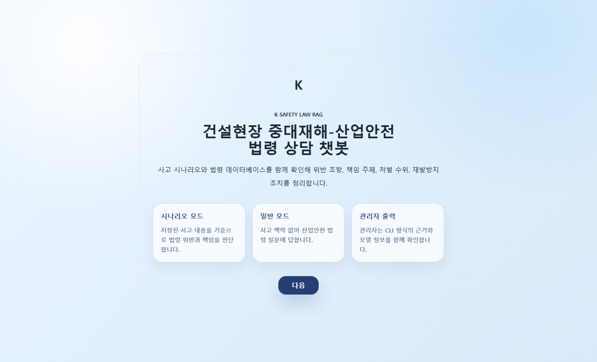
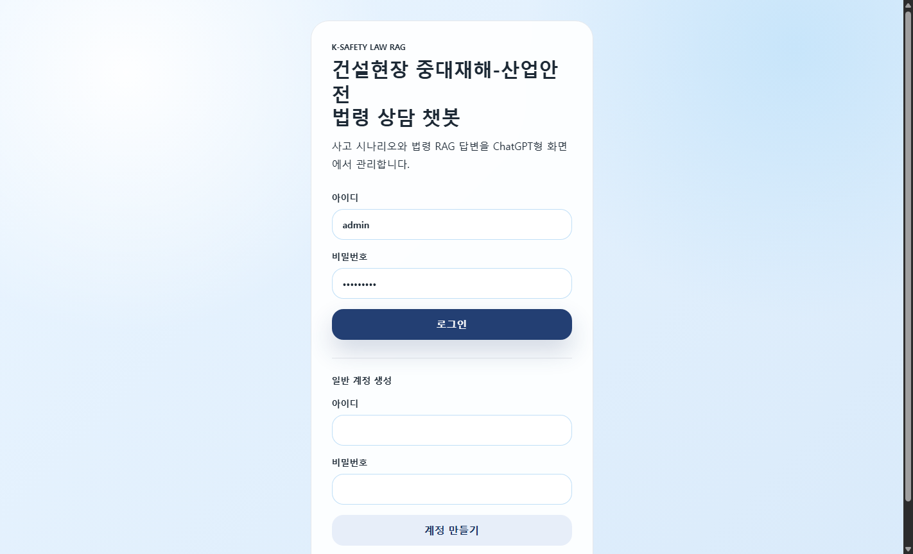
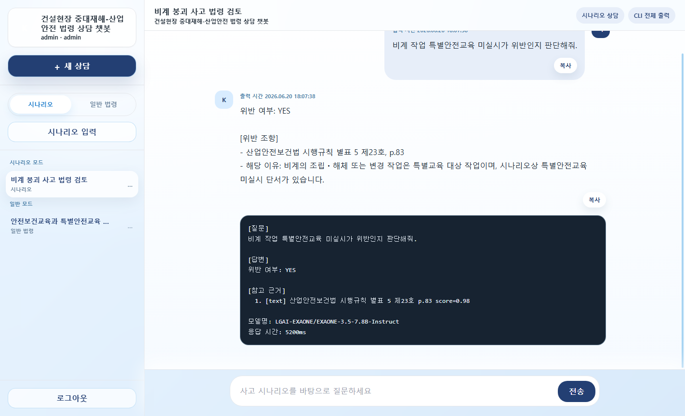
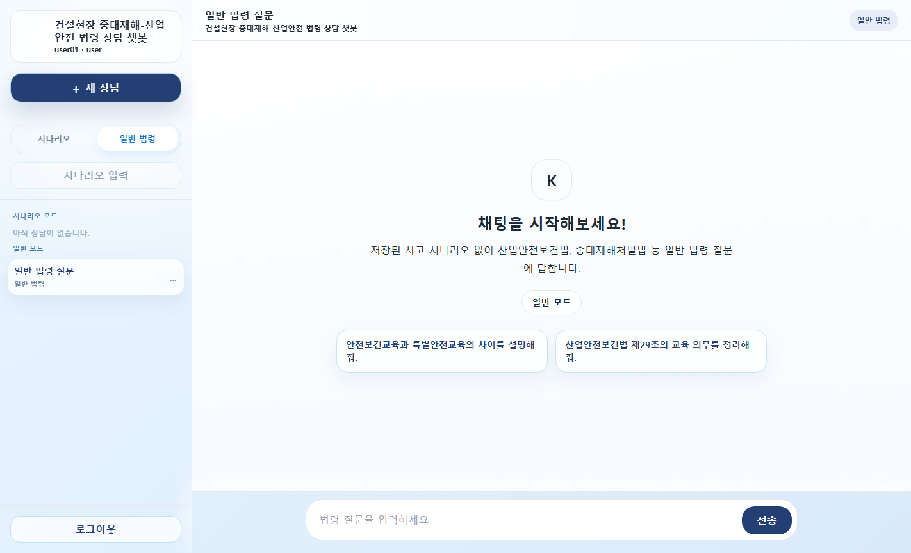
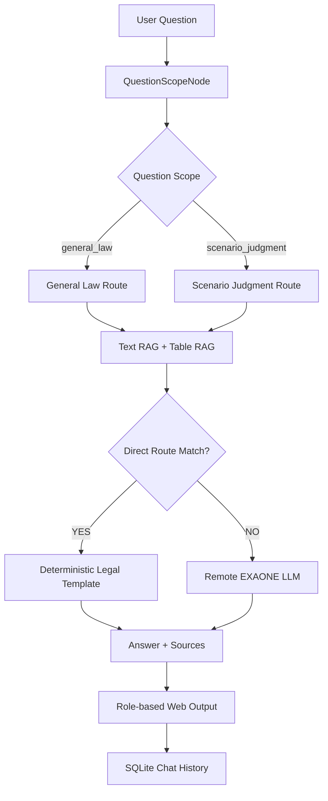

# 건설현장 중대재해-산업안전 법령 상담 챗봇

건설현장 사고 시나리오를 입력하면 산업안전보건법, 산업안전보건기준에 관한 규칙, 중대재해처벌법의 관련 조항을 검색하고 위반 여부, 책임 주체, 처벌 수위, 재발방지 조치를 정리하는 법령 RAG 챗봇입니다.

단순 PDF 검색기가 아니라 조문 본문과 별표/표 데이터를 분리 검색하고, 질문 범위에 따라 일반 법령 질의와 사고 시나리오 판단을 다르게 처리하도록 설계했습니다.

## Screenshots

### 진입 화면



### 로그인 화면



### 관리자 채팅 화면

관리자 계정은 일반 답변과 함께 CLI 형식의 참고 근거, score, 모델명, 응답 시간을 확인할 수 있습니다.



### 일반 법령 모드

일반 계정은 내부 score와 디버그 출력을 숨긴 답변 중심 화면을 사용합니다.



## 핵심 기능

- 건설현장 사고 시나리오 기반 법령 질의응답
- 시나리오 모드 / 일반 법령 모드 분리
- 관리자 계정 / 일반 계정별 출력 분리
- 사용자별 채팅 이력, 시나리오, 삭제 로그 DB 저장
- 채팅 이름 수정, 채팅 삭제, 질문/답변 복사
- 입력 시간 / 출력 시간 표시
- 모델 연결 실패 시 SweetAlert 알림
- 텍스트 법령 RAG와 별표/표 전용 Table RAG 통합 검색
- 질문 유형별 deterministic route로 EXAONE 7.8B의 조항 혼동 보정
- Colab EXAONE OpenAI-compatible 서버 연동

## 문제 정의

산업안전 법령 질의는 일반적인 의미 검색만으로 안정적인 답을 만들기 어렵습니다.

- 특별안전교육, 과태료, 교육 대상 작업은 별표와 표 안에 있어 일반 텍스트 청킹만으로 검색 누락이 발생합니다.
- `비계`, `도급`, `중대재해처벌법`, `경영책임자`처럼 비슷한 단어가 반복되면 LLM이 다른 조항을 섞어 답변할 수 있습니다.
- 사고 시나리오가 저장되어 있어도 사용자가 단순 법령 질문을 했을 때는 사고 위반 판단으로 과하게 라우팅되면 안 됩니다.
- 관리자에게는 근거와 디버그 정보가 필요하지만, 일반 사용자에게는 score나 내부 로그가 노출되지 않는 편이 좋습니다.

이 프로젝트는 위 문제를 해결하기 위해 RAG 검색, 질문 범위 분기, 정형 법령 라우팅, 사용자별 DB 저장을 함께 구현했습니다.

## 아키텍처



### 주요 처리 흐름

1. 사용자가 질문을 입력합니다.
2. `QuestionScopeNode`가 질문 자체를 보고 일반 법령 질문인지 사고 시나리오 판단인지 먼저 분류합니다.
3. 텍스트 법령 DB와 표 법령 DB를 함께 검색합니다.
4. 특별교육, 비계, 도급, 중대재해처벌법 처벌 수위 등 정형성이 높은 질문은 직접 구성 답변으로 처리합니다.
5. 그 외 질문은 Colab에서 실행 중인 EXAONE 모델로 전달합니다.
6. 답변, 근거, 모델 정보, 응답 시간을 SQLite DB에 저장합니다.
7. 관리자와 일반 사용자의 화면 출력 범위를 다르게 렌더링합니다.

## 기술 스택

| 영역 | 사용 기술 |
|---|---|
| Backend | Python, `http.server` 기반 Web UI 서버 |
| RAG | ChromaDB, BAAI/bge-m3, LangChain text splitters |
| PDF / Table | pypdf, pdfplumber, PyMuPDF |
| LLM | Colab EXAONE-3.5-7.8B-Instruct OpenAI-compatible API |
| Frontend | HTML, Tailwind CSS CDN, Vanilla JavaScript, SweetAlert2 |
| Database | SQLite |
| Runtime | Conda Python 3.11 환경 |

## 프로젝트 구조

```text
K-Safety Law RAG/
├── web_app.py                     # 웹 챗봇 서버
├── cli.py                         # CLI 실행 진입점
├── rag/
│   ├── chatbot.py                 # RAG 질의, direct route, LLM 호출
│   ├── question_graph.py          # QuestionScopeNode 분기 구조
│   ├── integrated_retriever.py    # 텍스트+표 검색 통합
│   ├── ingest.py                  # 텍스트 법령 PDF 임베딩
│   ├── table_retriever.py         # 표/별표 전용 임베딩 검색
│   └── schemas.py                 # 시나리오/채팅 데이터 모델
├── web/static/
│   ├── index.html                 # ChatGPT형 챗봇 UI
│   ├── app.js                     # UI 상태, API 호출, 채팅 렌더링
│   └── styles.css                 # 파스텔 블루 UI 스타일
├── notebooks/                     # Colab LLM 서버 노트북
├── data/laws/                     # 법령 PDF
├── chroma_db/                     # 텍스트 법령 벡터 DB
├── chroma_db_tables/              # 표 법령 벡터 DB
├── screenshots/portfolio/         # 포트폴리오용 현재 UI 캡처
├── docs/                          # 개발 과정 문서
├── scripts/                       # ingest/test 래퍼
└── requirements.txt
```

## 실행 방법

### 1. 환경 활성화

```cmd
conda activate p311_ragreport
cd /d "C:\K-Safety Law RAG"
```

### 2. `.env` 설정

Colab 또는 외부 GPU 서버에서 OpenAI-compatible LLM API를 실행한 뒤 `.env`에 연결 정보를 입력합니다.

```env
LLM_PROVIDER=remote_openai
LLM_MODEL=LGAI-EXAONE/EXAONE-3.5-7.8B-Instruct
LLM_API_BASE=https://YOUR_NGROK_URL/v1
LLM_API_KEY=dummy
```

### 3. 웹 UI 실행

프로젝트의 웹 실행 포트는 8200번으로 통일했습니다.

```cmd
python web_app.py --host 127.0.0.1 --port 8200
```

브라우저에서 아래 주소를 엽니다.

```text
http://127.0.0.1:8200
```

기본 관리자 계정:

```text
admin / admin1234
```

### 4. CLI 실행

```cmd
python cli.py
```

시나리오 파일 지정:

```cmd
python cli.py --scenario-file scenarios\default_accident.py
```

## DB 저장 정책

웹 UI는 `data/chatbot_ui.sqlite3`에 다음 데이터를 저장합니다.

- 사용자 계정과 역할
- 로그인 세션
- 사용자별 사고 시나리오
- 사용자별 상담 목록
- 질문/답변 메시지
- 채팅 삭제 로그

채팅 삭제는 DB에서 즉시 물리 삭제하지 않고 화면에서 숨김 처리합니다. 삭제 시점의 원본 스냅샷은 `deletion_logs`에 남겨 관리자가 추적할 수 있습니다.

## 질문 라우팅 예시

### 일반 법령 질문

```text
안전보건교육과 특별안전교육의 차이를 설명해줘.
```

질문 자체에 사고 지시어가 없으면 저장된 시나리오가 있더라도 일반 법령 질문으로 처리합니다.

### 시나리오 판단 질문

```text
위 사고에서 비계 작업 특별안전교육 미실시가 법령 위반에 해당하는가?
```

`위 사고`, `시나리오`, `C씨` 등 사고 지시어가 있으면 저장된 시나리오를 함께 사용해 위반 여부를 판단합니다.

### deterministic route

다음 유형은 LLM이 조항을 섞지 않도록 직접 구성 답변을 우선합니다.

- 비계 작업 특별안전교육: 산업안전보건법 시행규칙 별표 5 제23호
- 보호구 및 비계 설치 기준: 산업안전보건기준에 관한 규칙 제32조, 제42조, 제56조~제62조, 제14조
- 사업주 책임 및 특별안전교육 과태료: 산업안전보건법 시행령 별표 35
- 도급/원청 책임: 산업안전보건법 제64조, 중대재해처벌법 제5조, 시행령 제4조제9호
- 중대재해처벌법 적용 및 처벌 수위: 제2조, 제3조, 제4조, 제6조, 제7조, 제15조

## 법령 DB 재생성

법령 PDF를 교체하거나 추출 방식을 바꾼 경우에만 재임베딩합니다.

```cmd
python -m rag.ingest --reset
python -m rag.table_retriever --ingest --reset --strategy row
```

래퍼 스크립트:

```cmd
python scripts\run_ingest.py --reset
python scripts\reingest_tables.py
```

## 검증 명령

```cmd
node --check web\static\app.js
python -m compileall web_app.py rag\question_graph.py rag\chatbot.py
```

## 포트폴리오 포인트

- PDF 원문과 별표/표를 별도 벡터 DB로 분리해 법령 검색 정확도를 높였습니다.
- LLM만으로 처리하기 어려운 법령 조항 매핑은 deterministic route로 보정했습니다.
- 질문 범위 분기 노드를 추가해 단순 법령 질문이 사고 위반 판단으로 과잉 라우팅되는 문제를 줄였습니다.
- 관리자/일반 계정의 출력 권한을 분리해 운영자 디버깅과 사용자 가독성을 함께 고려했습니다.
- ChatGPT형 채팅 UX, 상담 관리, 삭제 로그, 입력/출력 시간 표시까지 구현해 CLI 프로젝트를 실제 웹 상담 도구로 확장했습니다.

## 한계와 주의

- 법률 판단 보조 도구이며 최종 법률 자문을 대체하지 않습니다.
- PDF 추출 품질에 따라 표/별표 검색 결과가 달라질 수 있습니다.
- EXAONE 7.8B 모델은 검색 결과 해석에서 혼동이 생길 수 있어 고위험 질문은 direct route로 보정했습니다.
- 로컬 RTX 3050 4GB 환경에서는 7.8B 모델 직접 구동이 어렵기 때문에 Colab GPU 서버 연동을 기본으로 사용합니다.
