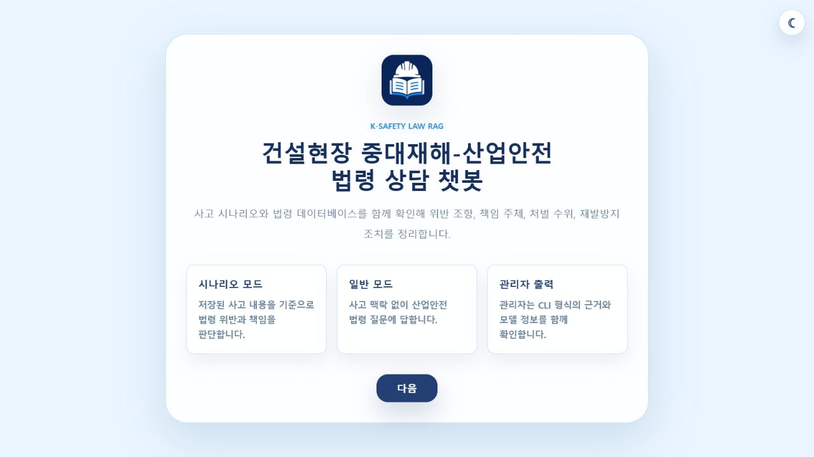
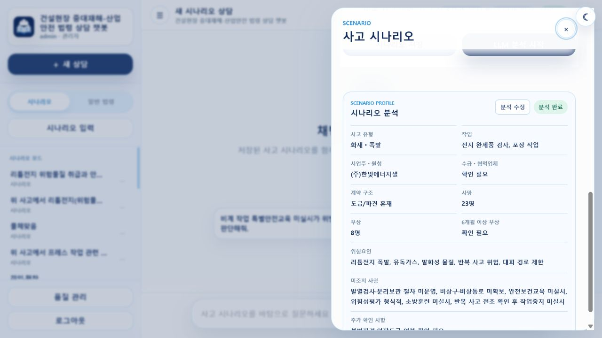
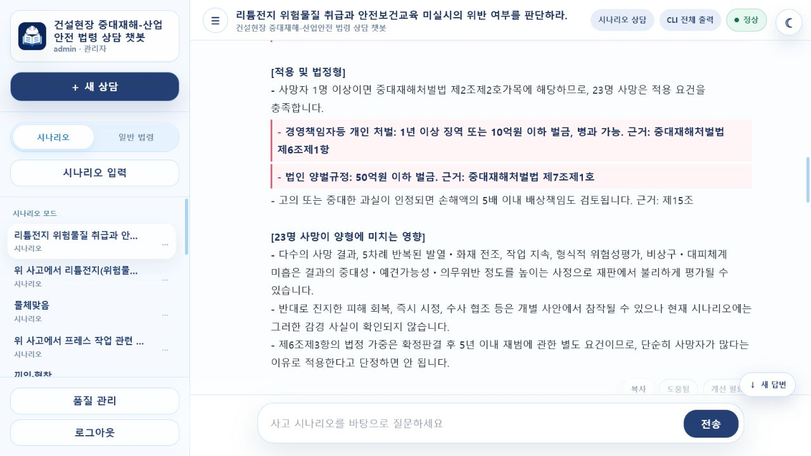
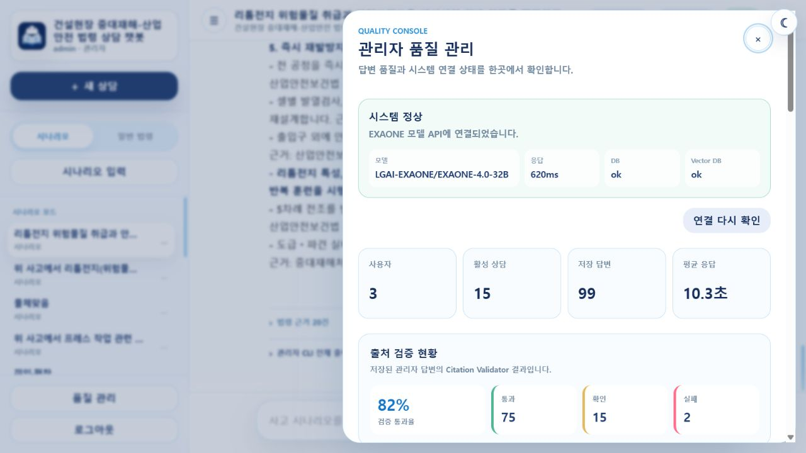
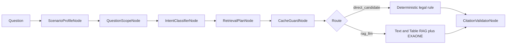
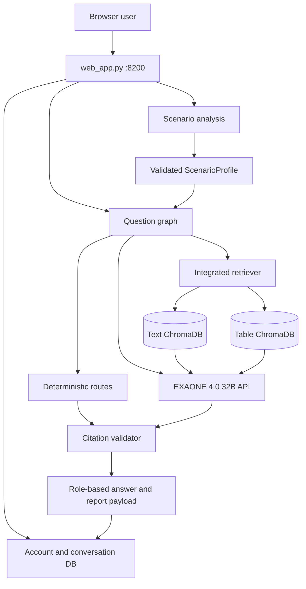

# 건설현장 중대재해-산업안전 법령 상담 챗봇

<p align="center">
  
</p>

산업재해 시나리오와 질문을 분석해 산업안전보건법, 산업안전보건기준에 관한 규칙, 산업안전보건법 시행령ㆍ시행규칙, 중대재해처벌법의 관련 근거를 제시하는 법령 RAG 웹 애플리케이션입니다.

이 프로젝트의 핵심은 LLM에게 검색 결과를 그대로 맡기지 않는 것입니다. PDF 본문과 별표ㆍ표를 분리 검색하고, 사고 사실을 구조화해 검증한 뒤, 질문 그래프와 사고 유형별 법령 규칙을 통해 답변 경로를 결정합니다. 정형화하기 어려운 질문만 EXAONE이 검색 근거 안에서 생성하도록 구성했습니다.

> 법률 판단을 지원하는 포트폴리오 프로젝트이며 변호사, 노무사 또는 관계 기관의 최종 법률 자문을 대체하지 않습니다.

## 현재 검증 상태

2026년 7월 22일 기준 로컬 재검증 결과입니다.

| 검증 항목 | 결과 |
|---|---:|
| Pytest 단위ㆍ회귀 테스트 | 38/38 통과 |
| 표준 사고 평가 문항 | 30/30 통과 |
| 평가 사고 유형 | 6개 유형 모두 100% |
| 배포 게이트 | 10/10 통과 |
| 리튬전지 다수사망 실제 API 재시험 | 5/5 분기ㆍ출처 검증 통과 |
| 출처 검증 | 전체 배포 문항 PASS |
| 제한 응답시간 | 모든 배포 문항 60초 이내 |

여기서 100%는 프로젝트에 포함된 고정 평가 문항의 통과율입니다. 모든 산업재해와 법률 질문에 대한 보편적인 법률 정확도를 의미하지 않습니다. 새로운 사고 유형은 별도의 법령 검토와 회귀 테스트가 필요합니다.

최신 자동 검증 리포트: [`data/evaluation_reports/v1_deployment_20260722_180116.json`](data/evaluation_reports/v1_deployment_20260722_180116.json)

### 개선 전후 수동 평가

법령 조항, 시나리오 맥락, 책임 주체와 종합보고서 구성을 문항별
루브릭으로 채점한 결과입니다.

| 사고 유형 | 1차 평가 | 개선 후 |
|---|---:|---:|
| 용접ㆍ도장 화재·폭발 | 43.6점 | 98점 |
| 굴착 토사 붕괴 | 33점 | 99점 |
| 프레스 끼임·협착 | 63점 | 94.4점 |
| 조적 낙하물 | 38점 | 99.6점 |
| **평균** | **44.4점** | **97.8점** |

시나리오 격리, 사망ㆍ부상 인원 검증, 질문 의도 분리, 결정형 법령
라우팅과 출처 검증을 적용해 평균 **53.4점**을 개선했습니다.

이 점수는 결과 보고서가 동일한 형식으로 정리된 4개 사고 유형의 수동
평가이며, 위의 `30/30`은 별도의 자동 배포 게이트 통과율입니다.

평가 기준, 문항별 실패 원인과 코드 개선 과정:
[`docs/EVALUATION.md`](docs/EVALUATION.md)

## 화면

### 핵심 사용자 흐름

| 제품 진입 | 시나리오 구조화 |
|---|---|
|  |  |

| 법령 판단 결과 | 관리자 품질 관리 |
|---|---|
|  |  |

저장한 사고는 답변 전에 사고 유형, 작업, 사업주ㆍ수급인, 사상자와
위험요인으로 구조화됩니다. 상담 화면은 중요한 처벌 수위와 법령 근거를
강조하고, 관리자 품질 관리 화면은 EXAONEㆍSQLiteㆍVector DB 연결 상태와
Citation Validator 통과율을 함께 보여줍니다.

보조 화면:
[로그인](screenshots/portfolio-refresh/02-login-light.png) ·
[일반 법령 모드](screenshots/portfolio-refresh/06-general-mode-light.png) ·
[실제 EXAONE 일반 답변](screenshots/portfolio-refresh/05-general-answer-light.png) ·
[관리자 CLI 전체 출력](screenshots/portfolio-refresh/08-admin-cli-light.png)

관리자는 답변과 함께 검색 근거, 정규화된 score, 모델명, 응답시간, 질문
그래프와 출처 검증 결과를 확인할 수 있습니다. 일반 계정에는 내부 검색
점수와 디버그 정보가 노출되지 않습니다.

## 주요 기능

- 시나리오 상담과 일반 법령 채팅 분리
- 저장한 사고 시나리오를 LLM으로 먼저 분석하는 `ScenarioProfileNode`
- 회사명, 사고 유형, 작업, 사망ㆍ부상 인원, 도급 구조, 위험요인 구조화
- Text RAG와 Table RAG를 결합한 법령ㆍ별표 검색
- 질문 유형별 결정형 법령 라우팅과 EXAONE RAG 생성 경로 분리
- 답변 조항과 반환 근거를 대조하는 출처 검증
- 관리자ㆍ일반 사용자별 출력 권한 분리
- 사용자별 시나리오와 상담 이력 격리
- 상담 이름 변경, 삭제, 질문ㆍ답변ㆍCLI 전체 출력 복사
- 삭제된 상담과 메시지의 감사 로그 보존
- 입력ㆍ출력 시간, 답변 생성 상태, 모델 연결 오류 표시
- page 7 법령 위반 사항과 page 12 종합평가 리포트 payload 생성

## 정확도를 높인 방법

### 1. 본문과 별표를 서로 다른 검색 단위로 구성

법령 조문은 `chroma_db`, 교육시간ㆍ특별교육ㆍ과태료 같은 표 데이터는 `chroma_db_tables`에 별도로 저장합니다. 일반 텍스트 청킹에서 구조가 무너지기 쉬운 별표 행을 Table RAG로 검색한 뒤 본문 결과와 통합합니다.

이 방식으로 별표 5의 작업 항목이나 별표 35의 과태료가 일반 조문과 섞이거나 검색에서 누락되는 문제를 줄였습니다.

### 2. 시나리오를 답변 전에 구조화하고 다시 검증

`LLM 분석 시작`을 누르면 EXAONE은 법률 판단이 아니라 사고 사실만 JSON으로 추출합니다. 이후 [`rag/scenario_analysis.py`](rag/scenario_analysis.py)가 다음 값을 결정형 규칙으로 재검증합니다.

- 원문에 실제로 등장한 회사명과 협력업체명만 허용
- `23명 사망, 8명 부상`처럼 명시된 인원을 정규식으로 다시 계산
- 직영ㆍ도급ㆍ파견ㆍ혼재 구조 판별
- 리튬전지 화재, 용접, 굴착, 프레스, 낙하물 등 사고 유형 보정
- 반복 전조, 작업중지 미실시, 형식적 위험성평가 같은 누락 조치 보완
- 시나리오 hash가 달라지면 기존 분석을 사용하지 않도록 무효화

따라서 LLM이 부상자 수나 회사명을 잘못 추출해도 원문에 근거한 검증 단계에서 교정됩니다.

### 3. 질문 그래프로 범위와 의도를 먼저 분리

[`rag/question_graph.py`](rag/question_graph.py)는 다음 순서로 실행됩니다.



- `QuestionScopeNode`: 일반 법령 설명과 현재 사고 판단을 구분
- `IntentClassifierNode`: 특별교육, 안전검사, 도급 책임, 처벌, 종합보고서 등을 분리
- `RetrievalPlanNode`: 필요한 조항과 직접응답 가능 여부 결정
- `CacheGuardNode`: 질문 전체와 시나리오 문맥으로 식별 키 생성

비슷한 키워드가 들어간 Q2와 Q4가 같은 답변을 반환하거나, 일반 질문이 저장된 사고의 위반 판단으로 바뀌는 문제를 이 단계에서 차단합니다.

### 4. 고위험 법률 사실은 결정형 규칙으로 제한

작업 종류와 조항의 대응, 사망ㆍ부상 기준, 벌금처럼 답이 정형화된 영역은 LLM이 조항을 새로 고르지 않습니다.

예시:

| 질문 유형 | 고정 검증 근거 |
|---|---|
| 비계 조립ㆍ해체 특별교육 | 시행규칙 별표 5 제23호 |
| 굴착면 2m 이상 특별교육 | 시행규칙 별표 5 제19호 |
| 프레스 방호ㆍ정비ㆍ검사 | 기준규칙 제87조~제104조, 법 제80조ㆍ제93조 |
| 낙하물ㆍ발끝막이판ㆍ출입통제 | 기준규칙 제13조ㆍ제14조ㆍ제20조 |
| 화기ㆍ용접 작업 | 기준규칙 제232조ㆍ제240조ㆍ제241조 |
| 리튬전지 화재ㆍ폭발 | 법 제29조ㆍ제36조ㆍ제51조, 기준규칙 제225조ㆍ제232조 |
| 사망 중대산업재해 | 중대재해처벌법 제2조제2호가목ㆍ제6조제1항ㆍ제7조제1호 |
| 장기치료 부상자 2명 이상 | 제2조제2호나목ㆍ제6조제2항ㆍ제7조제2호 |
| 도급ㆍ원청 책임 | 산업안전보건법 제63조ㆍ제64조, 중대재해처벌법 제5조 |

키워드 하나만으로 강제하지 않고 작업 동작과 질문 목적을 함께 확인합니다. 예를 들어 `철골 구조물 보수 용접`은 골조 조립ㆍ해체가 아니라 용접 경로로 보내고, `비계`가 있어도 보호구ㆍ설치기준 질문은 특별교육 답변으로 보내지 않습니다.

### 5. 이전 시나리오 혼입을 구조적으로 차단

과거에는 직접응답 템플릿에 특정 회사명과 작업이 남아 다른 사고에 재출력되는 문제가 있었습니다. 현재는 다음 방식으로 격리합니다.

- 답변에 현재 `ScenarioProfile`의 회사ㆍ작업ㆍ도급 구조를 동적 주입
- 미분류 사고가 과거 비계 기본 템플릿을 사용하는 fallback 차단
- 캐시 키에 질문 원문, 질문 의도, 모드, 전체 시나리오 문맥 포함
- 관리용 그래프 출력에 `scenario_profile_used`와 `scenario_kind` 기록
- 평가셋의 `forbidden_hits`로 다른 사고의 회사명ㆍ조항 혼입 검사

### 6. 생성 후 출처를 다시 검사

[`rag/citation_validator.py`](rag/citation_validator.py)는 답변에 표시된 법령명, 조항, 별표를 반환된 근거와 비교합니다. 다음과 같은 반복 오류도 별도로 탐지합니다.

- 법인 50억원 벌금의 근거를 시행령 별표 4로 잘못 표시
- 도급 책임을 언급하면서 산업안전보건법 제64조 또는 중대재해처벌법 제5조 누락
- 비계 특별교육을 언급하면서 별표 5 제23호 근거 누락
- 답변에만 존재하고 참고 근거에는 없는 조항 표시

검증 결과는 `PASS`, `WARN`, `FAIL`로 저장되며 관리자 화면과 CLI 출력에서 확인할 수 있습니다.

## 정확도 검증 방법

평가는 단순 문자열 일치가 아니라 각 문항에 대해 다음 조건을 검사합니다.

- 반드시 포함해야 하는 사고별 핵심 조항
- 절대 등장하면 안 되는 다른 사고의 회사명ㆍ작업ㆍ조항
- 사망과 장기치료 부상자 수에 따른 중대재해처벌법 분기
- 사업주, 경영책임자, 법인, 근로자 책임 주체 분리
- 답변의 인용 조항과 반환 근거의 일치
- page 7과 page 12 payload 계약
- 60초 이내 응답
- 직전 질문이나 이전 시나리오 답변 재사용 여부

### 표준 사고 평가 결과

| 평가 범주 | 문항 | 결과 |
|---|---:|---:|
| 비계 추락 | 5 | 5/5 |
| 프레스 끼임 | 5 | 5/5 |
| 인양물 물체맞음 | 5 | 5/5 |
| 조적 낙하물 | 5 | 5/5 |
| 굴착 붕괴 | 5 | 5/5 |
| 용접 화재ㆍ폭발 | 5 | 5/5 |
| **합계** | **30** | **30/30** |

추가 holdout 성격의 리튬전지 다수사망 사고는 위험물ㆍ교육, 다수사망 양형, 파견ㆍ도급, 형식적 위험성평가ㆍ반복 전조, 종합보고서의 5개 질문으로 실제 8200 API와 SQLite 저장 결과를 확인했습니다. 다섯 질문은 서로 다른 intent로 분리되었고 모두 `scenario_profile_used=true`, 출처 검증 `PASS`를 기록했습니다.

## 시스템 구성



## 기술 스택

| 영역 | 기술 |
|---|---|
| Backend | Python 3.11, FastAPI, Uvicorn, Pydantic |
| RAG | ChromaDB, BAAI/bge-m3, LangChain text splitters |
| PDFㆍ표 추출 | pypdf, pdfplumber, PyMuPDF |
| LLM | Colab EXAONE-4.0-32B, OpenAI-compatible API, 비추론 모드 |
| Frontend | HTML, Tailwind CSS 3, Vanilla JavaScript, SweetAlert2 |
| Database | SQLite |
| Test | pytest, 자동 배포 게이트, 실제 HTTP API 재시험 |

## 프로젝트 구조

```text
K-Safety Law RAG/
├── web_app.py                         # 인증ㆍ상담ㆍ시나리오ㆍ관리자 API
├── cli.py                             # CLI 실행 진입점
├── rag/
│   ├── chatbot.py                     # RAG와 직접응답 통합
│   ├── question_graph.py              # 질문 범위ㆍ의도ㆍ경로 그래프
│   ├── scenario_analysis.py           # LLM 사실 추출과 결정형 검증
│   ├── citation_validator.py           # 답변과 출처 정합성 검사
│   ├── integrated_retriever.py         # Text RAG + Table RAG
│   ├── industrial_fire_routing.py      # 리튬전지 복합 화재 분기
│   ├── falling_object_routing.py       # 조적ㆍ낙하물 분기
│   ├── v1_incident_routing.py          # 끼임ㆍ물체맞음 공통 분기
│   ├── hot_work_routing.py             # 용접ㆍ굴착 분기
│   └── general_law_routing.py          # 일반 법령 질문
├── web/static/                         # ChatGPT형 파스텔 블루 UI
├── notebooks/                          # Colab EXAONE 서버 노트북
├── data/laws/                          # 법령 PDF 원본
├── data/evaluation_reports/            # 자동 평가 결과
├── chroma_db/                          # 본문 벡터 DB
├── chroma_db_tables/                   # 별표ㆍ표 벡터 DB
├── test/evaluation_cases.json          # 배포 평가 문항
├── tests/                              # 단위ㆍ회귀 테스트
└── scripts/check_v1_deployment.py      # 최종 배포 게이트
```

## 실행 방법

### 1. 환경 준비

```powershell
conda activate p311_ragreport
Set-Location "C:\K-Safety Law RAG"
pip install -r requirements.txt
npm install
npm run build:css
```

### 2. EXAONE API 설정

Colab에서 EXAONE OpenAI-compatible 서버를 실행하고 `.env`를 설정합니다.

```env
LLM_PROVIDER=remote_openai
LLM_MODEL=LGAI-EXAONE/EXAONE-4.0-32B
LLM_API_BASE=https://YOUR_NGROK_URL/v1
LLM_API_KEY=dummy
```

정형 법령 질문은 `direct_candidate` 경로를 사용하므로 EXAONE을 호출하지 않을 수 있습니다. 관리자 질문 그래프에서 `deterministic_legal_rule` 또는 `rag_llm_generation`을 확인할 수 있습니다.

### 3. 웹 서버 실행

프로젝트 포트는 8200으로 통일합니다.

```powershell
$env:WEB_ADMIN_USERNAME="admin"
$env:WEB_ADMIN_PASSWORD="충분히-긴-초기-비밀번호"
$env:WEB_ALLOW_REGISTRATION="false"
$env:WEB_ALLOWED_HOSTS="localhost,127.0.0.1"
python web_app.py --host 127.0.0.1 --port 8200
```

브라우저: [http://127.0.0.1:8200](http://127.0.0.1:8200)

관리자 계정은 DB 최초 생성 시에만 만들어집니다. `WEB_ADMIN_PASSWORD`를 생략하면 안전한 임시 비밀번호가 생성되어 최초 실행 콘솔에 한 번만 표시되며, 기존 계정의 비밀번호를 콘솔에 다시 출력하지 않습니다.

`web_app.py`는 FastAPI/Uvicorn 단일 worker로 실행됩니다. HTTPS 리버스 프록시 뒤에서 운영할 때는 `WEB_SECURE_COOKIES=true`, 실제 서비스 도메인을 `WEB_ALLOWED_HOSTS`에 설정하세요. 공개 회원가입이 필요한 기간에만 `WEB_ALLOW_REGISTRATION=true`로 설정합니다. 모든 로그인 후 변경 요청에는 세션별 CSRF 토큰이 적용되며, 로그인 실패는 기본 5회/5분 기준으로 제한됩니다.

### 운영 배포 설정

현재 웹 애플리케이션과 EXAONE 추론 서버는 분리되어 있습니다. FastAPI/Uvicorn 웹 서버와 SQLiteㆍChromaDB는 로컬 또는 배포 서버에서 실행하고, GPU가 필요한 EXAONE-4.0-32B는 Colab Pro의 OpenAI-compatible API로 호출합니다. Colab 런타임이 종료되거나 ngrok 주소가 바뀌면 `.env`의 `LLM_API_BASE`를 갱신해야 합니다.

| 환경변수 | 기본값 | 운영 권장값 |
|---|---:|---|
| `WEB_ALLOW_REGISTRATION` | `false` | 계정 발급 기간에만 `true` |
| `WEB_SECURE_COOKIES` | `false` | HTTPS 배포 시 `true` |
| `WEB_ALLOWED_HOSTS` | `localhost,127.0.0.1` | 실제 서비스 도메인 추가 |
| `WEB_MAX_REQUEST_BYTES` | `1048576` | 특별한 이유가 없으면 유지 |
| `WEB_LOGIN_ATTEMPT_LIMIT` | `5` | 유지 또는 더 엄격하게 설정 |
| `WEB_LOGIN_ATTEMPT_WINDOW` | `300` | 초 단위, 기본 5분 |

배포 서버는 다음 보호 기능을 기본 적용합니다.

- 세션 쿠키 `HttpOnly`, `SameSite=Lax`와 운영용 `Secure` 플래그
- 로그인 후 `POST`ㆍ`PATCH`ㆍ`DELETE` 요청의 세션별 CSRF 검증
- 로그인 실패 횟수 제한과 회원가입 기본 차단
- CSP, HSTS, 클릭재킹ㆍMIME 스니핑 방지 헤더
- 요청 본문 크기 제한과 허용 호스트 검증
- 계정별 상담ㆍ시나리오 소유권 검사

상태 확인 엔드포인트는 다음과 같습니다.

```text
GET /healthz  # 프로세스와 SQLite 연결 확인
GET /readyz   # 정적 자원과 데이터 경로 준비 확인
```

`/healthz`가 정상이어도 Colab 모델 API는 별도로 중단될 수 있습니다. 모델 연결 실패 시 프론트에는 사용자용 오류가 표시되고, 관리자는 모델 상태와 CLI 출력을 통해 원인을 확인합니다. Colab 재연결 후에는 배포 게이트를 다시 실행해야 합니다.

### 4. CLI 실행

```powershell
python cli.py
python cli.py --scenario-file scenarios\default_accident.py
```

## 법령 DB 재생성

법령 PDF나 청킹 정책을 변경했을 때만 재생성합니다.

```powershell
python -m rag.ingest --reset
python -m rag.table_retriever --ingest --reset --strategy row
```

## 테스트와 재현

실제 서버와 같은 Conda 환경에서 실행하는 것을 권장합니다.

```powershell
python -m pytest -q
python scripts\check_v1_deployment.py
node --check web\static\app.js
python -m compileall -q rag web_app.py tests
```

배포 게이트는 사고 유형별 필수ㆍ금지 표현, 출처 검증, 응답시간, 시나리오 격리, 일반 법령 정확성, 근로자 책임 분리를 모두 통과해야 성공합니다. 결과 JSON은 `data/evaluation_reports`에 저장됩니다.

현재 단위ㆍ회귀ㆍ웹 보안 테스트는 `38 passed`입니다. 테스트에는 일반 기업 법령 Q&A, 하드코딩된 과거 시나리오 차단, 계정별 상담 격리, CSRF, 회원가입 정책, 로그인 속도 제한과 보안 헤더 검증이 포함됩니다. Colab 모델을 사용하는 배포 게이트는 원격 런타임이 정상 연결된 상태에서 별도로 통과해야 최종 배포 완료로 판단합니다.

## DB와 권한 정책

`data/chatbot_ui.sqlite3`에는 다음 테이블이 생성됩니다.

- `users`, `sessions`: 계정ㆍ역할과 로그인 세션
- `scenarios`, `scenario_analyses`: 사용자별 사고 원문과 검증된 분석
- `conversations`, `messages`: 모드별 상담과 질문ㆍ답변
- `deletion_logs`: 삭제된 상담ㆍ메시지의 감사 스냅샷
- `answer_feedback`: 답변 평가

모든 상담ㆍ시나리오 조회는 로그인한 `user_id`로 제한됩니다. 삭제는 화면에서 숨기는 soft delete이며 원본 스냅샷은 감사 로그에 남습니다.

## 한계와 다음 단계

- 현재 자동 검증 범위는 비계, 프레스, 인양물, 조적 낙하물, 굴착, 용접 화재와 리튬전지 복합사고입니다.
- 감전, 질식, 화학물질 누출 등 미등록 사고는 RAGㆍLLM 경로를 사용하므로 별도 검증이 필요합니다.
- 실제 위험물 해당 여부는 물질안전보건자료와 산업안전보건기준에 관한 규칙 별표 1의 물질 분류를 확인해야 합니다.
- 다수사망은 양형상 불리한 사정이 될 수 있지만 사망자 수만으로 중대재해처벌법 제6조제1항의 법정형 상한이 자동 상향되지는 않습니다.
- 판례 기반 책임 비율, 불법파견 확정, 재범 가중처벌은 사실관계와 확정판결 이력 검토가 필요하므로 자동 단정하지 않습니다.

다음 단계는 판례ㆍ행정해석 데이터셋 추가, 미등록 사고 holdout 확대, 법령 개정 감지와 재임베딩 자동화입니다.
